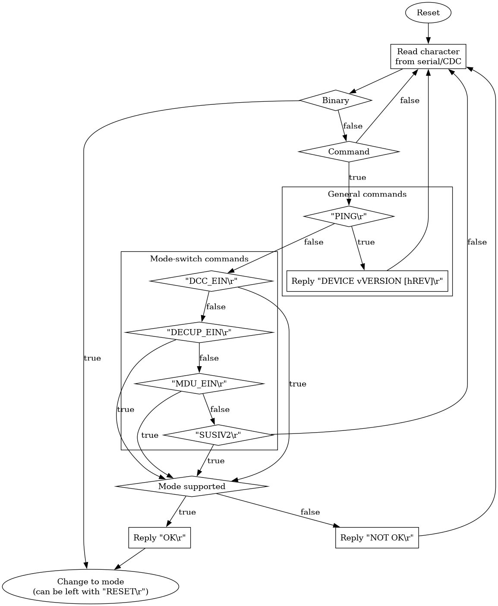

# ULF_COM

[](https://github.com/ZIMO-Elektronik/ULF_COM/actions/workflows/build.yml) [](https://github.com/ZIMO-Elektronik/ULF_COM/actions/workflows/tests.yml)


Most ZIMO devices, especially the [MXULF](http://www.zimo.at/web2010/products/InfMXULF_EN.htm), a device for updating and testing model railway decoders, support many different serial protocols. ULF_COM aims to provide an overview of the supported protocols and, above all, to help identify and switch over the currently active one. The following protocols are currently supported:
| Protocol                                                          | Description                                                                                                             | Supported by                                                                                                                                                                                                                                                             |
| ----------------------------------------------------------------- | ----------------------------------------------------------------------------------------------------------------------- | ------------------------------------------------------------------------------------------------------------------------------------------------------------------------------------------------------------------------------------------------------------------------ |
| [ULF_DCC_EIN](https://github.com/ZIMO-Elektronik/ULF_DCC_EIN)     | [DCC](https://github.com/ZIMO-Elektronik/DCC) as ASCII                                                                  | [MXULF](http://www.zimo.at/web2010/products/InfMXULF_EN.htm), [ZSP](http://www.zimo.at/web2010/products/zsp_zimo-sound-programmer.htm)                                                                                                                                   |
| [ULF_DECUP_EIN](https://github.com/ZIMO-Elektronik/ULF_DECUP_EIN) | MX [ZPP](https://github.com/ZIMO-Elektronik/ZPP) and [ZSU](https://github.com/ZIMO-Elektronik/ZSU) updates via tracks   | [MXULF](http://www.zimo.at/web2010/products/InfMXULF_EN.htm), [Z21](https://www.z21.eu/en), [ZCS](https://www.beathis.ch/impressum.html), [ZSP](http://www.zimo.at/web2010/products/zsp_zimo-sound-programmer.htm)                                                       |
| [ULF_MDU_EIN](https://github.com/ZIMO-Elektronik/ULF_MDU_EIN)     | MS/N [ZPP](https://github.com/ZIMO-Elektronik/ZPP) and [ZSU](https://github.com/ZIMO-Elektronik/ZSU) updates via tracks | [MXULF](http://www.zimo.at/web2010/products/InfMXULF_EN.htm), [Z21](https://www.z21.eu/en)                                                                                                                                                                               |
| [ULF_MX1BIN](https://github.com/ZIMO-Elektronik/ULF_MX1BIN)       | Original [MX1](http://www.zimo.at/web2010/products/mx1_EN.htm) command and control                                      | [JRMI](https://www.jmri.org/), [MX1](http://www.zimo.at/web2010/products/mx1_EN.htm), [MXULF](http://www.zimo.at/web2010/products/InfMXULF_EN.htm), [TrainController](https://www.freiwald.com/seiten/traincontroller.htm), [ZCS](https://www.beathis.ch/impressum.html) |
| [ULF_SUSIV2](https://github.com/ZIMO-Elektronik/ULF_SUSIV2)       | [ZPP](https://github.com/ZIMO-Elektronik/ZPP) updates via SUSI                                                          | [MXULF](http://www.zimo.at/web2010/products/InfMXULF_EN.htm), [ZSP](http://www.zimo.at/web2010/products/zsp_zimo-sound-programmer.htm)                                                                                                                                   |

<details>
  <summary>Table of contents</summary>
  <ol>
    <li><a href="#operating-modes">Operating modes</a></li>
    <li><a href="#getting-started">Getting started</a></li>
      <ul>
        <li><a href="#prerequisites">Prerequisites</a></li>
        <li><a href="#installation">Installation</a></li>
        <li><a href="#build">Build</a></li>
      </ul>
    <li><a href="#usage">Usage</a></li>
  </ol>
</details>

## Operating modes
The support of many different protocols unfortunately makes the exact process of when and how to switch between them a bit confusing. The default mode that is active after the reset was always the MX1 binary protocol. Special commands that do not correspond to the binary protocol scheme were added later to switch to other modes or to perform other tasks (e.g. status queries).

| Mode                                                              | Enter                                                    | Leave       |
| ----------------------------------------------------------------- | -------------------------------------------------------- | ----------- |
| [ULF_DCC_EIN](https://github.com/ZIMO-Elektronik/ULF_DCC_EIN)     | `"DCC_EIN\r"`                                            | `"RESET\r"` |
| [ULF_DECUP_EIN](https://github.com/ZIMO-Elektronik/ULF_DECUP_EIN) | `"DECUP_EIN\r"`                                          | `"RESET\r"` |
| [ULF_MDU_EIN](https://github.com/ZIMO-Elektronik/ULF_MDU_EIN)     | `"MDU_EIN\r"`                                            | `"RESET\r"` |
| [ULF_MX1BIN](https://github.com/ZIMO-Elektronik/ULF_MX1BIN)       | Receive any binary schema (`"\x01\x01.+?(?<!\x10)\x17"`) | `"RESET\r"` |
| [ULF_SUSIV2](https://github.com/ZIMO-Elektronik/ULF_SUSIV2)       | `"SUSIV2\r"`                                             | `"RESET\r"` |

The following flowchart shows how to switch between the protocols. Receipt of any binary protocol command results in a switch to binary protocol. In order to switch to one of the other operating modes, the name of the protocol including carriage return character must be received. All modes can be exited by receiving a `"RESET\r"` command. This will restore the initial state.


The ULF_COM library contains various helper functions that can help with recognizing the mode from a string. Please refer to [Usage](#usage) chapter for further details.

## Getting started
### Prerequisites
- C++23 compatible compiler
- [CMake](https://cmake.org/) ( >= 3.25 )

### Installation
This library is meant to be consumed with CMake.

```cmake
# Either by including it with CPM
cpmaddpackage("gh:ZIMO-Elektronik/ULF_COM@0.0.1")

# or the FetchContent module
FetchContent_Declare(
  DCC
  GIT_REPOSITORY https://github.com/ZIMO-Elektronik/ULF_COM
  GIT_TAG v0.0.1)

target_link_libraries(YourTarget INTERFACE ULF::COM)
```

### Build
If the build is running as a top-level CMake project then tests and a small example will be generated.
```sh
cmake -Bbuild
cmake --build build --target ULF_COMExamples
```

## Usage
To check whether a string contains an MX1 binary protocol frame or a command, the two functions `str2mx1bin` or `str2cmd` can be used. Both functions expect that the searched schema is at the beginning of the string. In order to be able to distinguish between an error case and the case where the data is still incomplete, the return value of both functions is `std::expected<std::optional<std::string_view>, std::errc>`. If the pattern is not recognized at all, i.e. in the event of an error, then a `std::errc` is returned. If something is found but the data is not yet complete, a `std::nullopt` is returned. Otherwise the found data is returned as `std::string_view`. The following snippet shows how `str2mx1bin` can be used.
```cpp
// Check if character stream contains valid MX1 binary
auto maybe_mx1bin{ulfcom::str2mx1bin("\x01\x01"
                                      "data\x17")};

// Could be MX1 binary
if (maybe_mx1bin) {
  // Already complete?
  if (*maybe_mx1bin) {
    // Complete MX1 binary
    auto mx1bin{**maybe_mx1bin};
  }
  // No, still missing characters
  else {}
}
// Error, not MX1 binary scheme
else {}
```

Alternatively, the monadic extensions of `std::expected` and `std::optional` can be used.

Also part of this library is the `ping` function, which can be used to generate a response to the `"PING\r"` command. There are two overloads available, one that only takes the device name and a version, and one that also allows specifying a hardware revision.
```cpp
// Replies to "PING\r"
auto ping{ulfcom::ping("MyDevice", "1.2.3")};
auto ping_with_rev{ulfcom::ping("MyDevice", "1.2.3", 'B')};
```